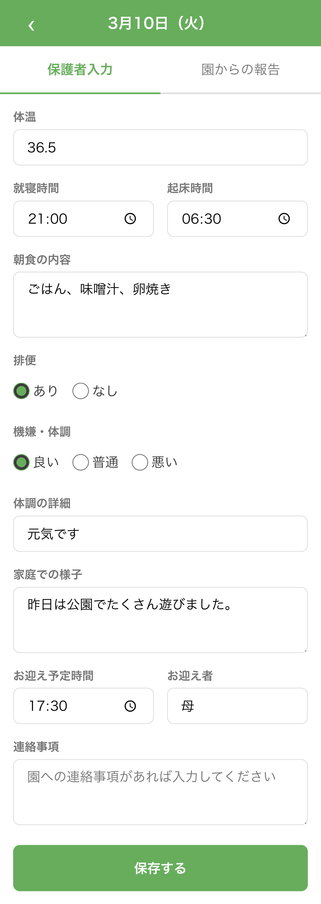
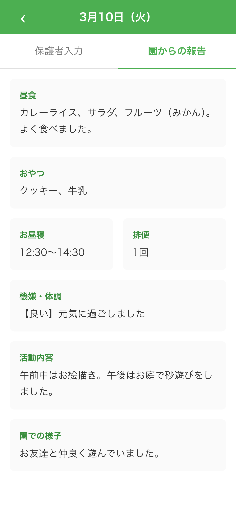

# フロントエンドデザインスキルを使ったサンプルアプリ

[Anthropic 公式のフロントエンドデザインスキル](https://github.com/anthropics/claude-plugins-official/blob/main/plugins/frontend-design/skills/frontend-design/SKILL.md)を使用して作成した、保育園向け「れんらくちょう（連絡帳）」アプリケーションです。

保護者が子どもの体温・食事・体調などを記録し、園からの報告を確認できるデジタル連絡帳として機能します。

## 画面イメージ

|                    カレンダー                    |                    保護者入力                    |                    園からの報告                    |
| :----------------------------------------------: | :----------------------------------------------: | :------------------------------------------------: |
|  |  |  |

## 技術スタック

- **React 19** + **TypeScript 5.9**
- **React Router v7** (SSR 有効)
- **Vite 7** (ビルドツール)
- **Vitest 4** + Testing Library (テスト)
- **CSS Modules** + カスタムプロパティ (スタイリング)
- **pnpm** (パッケージマネージャー)

## セットアップ

```bash
pnpm install
```

## 開発

```bash
# 開発サーバー起動
pnpm dev

# テスト実行
pnpm test

# テスト（監視モード）
pnpm test:watch

# ビルド
pnpm build

# 本番サーバー起動
pnpm start
```

## プロジェクト構成

```
app/
├── components/
│   ├── calendar/       # カレンダー表示 (CalendarHeader, CalendarGrid, CalendarDay)
│   ├── forms/          # 保護者入力フォーム (ParentEntryForm)
│   ├── report/         # 園からの報告 (NurseryReport)
│   └── ui/             # 汎用 UI (TabSwitcher)
├── data/               # データ層 (repository, モックデータ)
├── routes/             # ページコンポーネント
│   ├── calendar.tsx    # カレンダー一覧ページ (/)
│   └── day.$date.tsx   # 日別詳細ページ (/day/:date)
├── styles/             # グローバルスタイル・デザイントークン
├── types/              # 型定義
└── utils/              # ユーティリティ関数 (日付・カレンダー計算)
```

## 主な機能

- **カレンダー表示**: 月別カレンダーで入力状況を色分け表示（入力済み: 緑、園報告あり: 青）
- **保護者入力**: 体温・睡眠時間・朝食・排便・体調・お迎え情報などを記録
- **園からの報告**: 昼食・おやつ・お昼寝・活動内容・園での様子を確認

## その他

以下のコマンドで環境ファイルの作成を実施。

```bash
touch README.md && cat << 'EOF' > CLAUDE.md
# CLAUDE.md

## Context

- see @AGENTS.md
EOF
cat << 'EOF' > AGENTS.md
# AGENTS.md

## Guideline

- follow TDD, follow t-wada method
- read the latest code when starting a new task, because it might be updated independently of your work

### Naming Rules

- Variable names, function names, and database column names should be written in English.
- Romanized Japanese (romaji) should be avoided and only used when absolutely necessary.

Example:
- Good: `last_name_kana`
- Bad: `sei_kana`

- Use plural names only for arrays.
- Use singular names for non-array values.

---

## Workflow

### 1. Plan Mode Default

- Enter plan mode for ANY non-trivial task (3+ steps or architectural decisions)
- If something goes sideways, STOP and re-plan immediately – don't keep pushing
- Use plan mode for verification steps, not just building
- Write detailed specs upfront to reduce ambiguity

### 2. Subagent Strategy

- Use subagents liberally to keep main context window clean
- Offload research, exploration, and parallel analysis to subagents
- For complex problems, throw more compute at it via subagents
- One task per subagent for focused execution

### 3. Self-Improvement Loop

- After ANY correction from the user: update `tasks/lessons.md` with the pattern
- Write rules for yourself that prevent the same mistake
- Ruthlessly iterate on these lessons until mistake rate drops
- Review lessons at session start forelevant project

### 4. Verification Before Done

- Never mark a task complete without proving it works
- Diff behavior between main and your changes when relevant
- Ask yourself: "Would a staff engineer approve this?"
- Run tests, check logs, demonstrate correctness

### 5. Demand Elegance

- For non-trivial changes: pause and ask "is there a more elegant way?"
- If a fix feels hacky: "Knowing everything I know now, implement the elegant solution"
- Skip this for simple, obvious fixes – don't over-engineer
- Challenge your own work before presenting it

### 6. Autonomous Bug Fixing

- When given a bug report: just fix it. Don't ask for hand-holding
- Point at logs, errors, failing tests – then resolve them
- Zero context switching required from the user
- Go fix failing CI tests without being told how

---

## Task Management

1. Plan First: Write plan to `tasks/todo.md` with checkable items
2. Verify Plan: Check in before starting implementation
3. Track Progress: Mark items complete as you go
4. ExplChanges: High-level summary at each step
5. Document Results: Add review section to `tasks/todo.md`
6. Capture Lessons: Update `tasks/lessons.md` after corrections

---

## Core Principles

- Simplicity First: Make every change as simple as possible. Impact minimal code.
- No Laziness: Find root causes. No temporary fixes. Senior developer standards.
- Minimal Impact: Changes should only touch what's necessary. Avoid introducing bugs.

---

## Development Environment

- use `pnpm` as a package manager
- use `vitest` for testing

EOF
cat << 'EOF' > .gitignore
# See https://help.github.com/articles/ignoring-files/ for more about ignoring files.

# dependencies
/node_modules

# next.js
/.next/
/out/

# production
/build

# debug
npm-debug.log*
yarn-debug.log*
yarn-error.log*
.pnpm-debug.log*

# env files
.env*
!.env*.example

# vercel
.vercel

# typescript
*.tsbuildinfo
next-env.d.ts

# agent settings
/tasks/

# others
.DS_Store
EOF
pnpm install && git init
```
